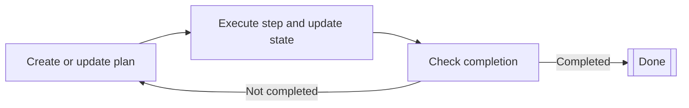

# Planner agents

Planner agents are AI agents that plan and execute multistep tasks through iterative planning cycles.
They continuously build or update plans, execute steps, and check completion criteria against the current state.

Planner agents are suitable for complex tasks
that require breaking down a high-level goal into smaller, actionable steps
and adapting the plan based on the results of each step.

While with [graph-based agents](../graph-based-agents.md) you define all the nodes and edges,
for planner agents, you only define the actions (nodes) with typed inputs and outputs.
The planner creates reasonable edges that would be suitable to achieve the desired state,
and it can also update the optimal path between steps.
This allows for a more dynamic approach which can be more powerful 
but less controllable compared to graph-based agents.

Planner agents operate through an iterative planning cycle:

1. The planner creates or updates a plan based on the current state.
2. The planner executes a single step from the plan, updating the state.
3. The planner determines whether the plan is completed according to the current state.
    - If the plan is completed, the cycle ends.
    - If the plan is not completed, the cycle repeats from the first step.

Koog provides two types of planner agents:

- [LLM-based planners](llm-based-planners.md) use an LLM to create and update plans
- [GOAP agents](goap-agents.md) use a special algorithm to determine the optimal action sequences
