# Predefined nodes and components

Nodes are the fundamental building blocks of agent workflows in the Koog framework.
Each node represents a specific operation or transformation in the workflow, and they can be connected using edges to define the flow of execution.

In general, nodes let you encapsulate complex logic into reusable components that can be easily integrated into
different agent workflows. This guide will walk you through the existing nodes that can be used in your agent
strategies.

Each node is essentially a function that takes an input of a specific type and returns an output of a specific type.

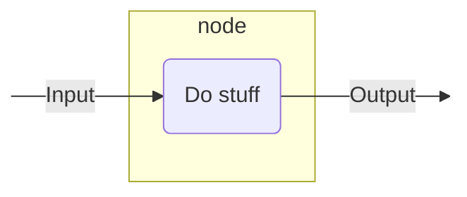

Here is how you can define a node that expects a string as input and returns the length of the string (an integer) as output:

<!--- INCLUDE
import ai.koog.agents.core.dsl.builder.strategy

val strategy = strategy<String, String>("strategy_name") {
-->
<!--- SUFFIX
}
-->
```kotlin
val nodeLength by node<String, Int> { input ->
    input.length
}
```
<!--- KNIT example-nodes-and-component-01.kt -->

For more information, see [`node()`](api:agents-core::ai.koog.agents.core.dsl.builder.AIAgentSubgraphBuilderBase.node).

## Utility nodes

### nodeDoNothing

A simple pass-through node that does nothing and returns the input as output. For details, see [API reference](api:agents-core::ai.koog.agents.core.dsl.extension.nodeDoNothing).

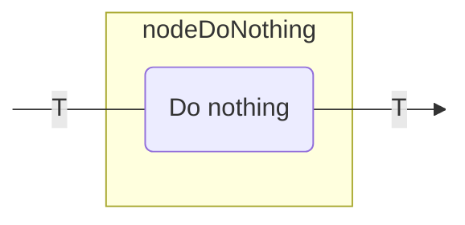

You can use this node for the following purposes:

- Create a placeholder node in your graph.
- Create a connection point without modifying the data.

Here is an example:

<!--- INCLUDE
import ai.koog.agents.core.dsl.builder.forwardTo
import ai.koog.agents.core.dsl.builder.strategy
import ai.koog.agents.core.dsl.extension.nodeDoNothing

val strategy = strategy<String, String>("strategy_name") {
-->
<!--- SUFFIX
}
-->
```kotlin
val passthrough by nodeDoNothing<String>("passthrough")

edge(nodeStart forwardTo passthrough)
edge(passthrough forwardTo nodeFinish)
```
<!--- KNIT example-nodes-and-component-02.kt -->

## LLM nodes

### nodeAppendPrompt

A node that adds messages to the LLM prompt using the provided prompt builder.
This is useful for modifying the conversation context before making an actual LLM request. For details, see [API reference](api:agents-core::ai.koog.agents.core.dsl.extension.nodeUpdatePrompt).

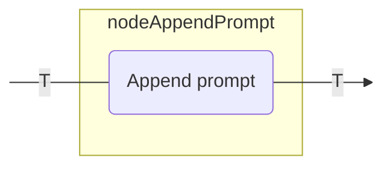

You can use this node for the following purposes:

- Add system instructions to the prompt.
- Insert user messages into the conversation.
- Prepare the context for subsequent LLM requests.

Here is an example:

<!--- INCLUDE
import ai.koog.agents.core.dsl.builder.forwardTo
import ai.koog.agents.core.dsl.builder.strategy
import ai.koog.agents.core.dsl.extension.nodeAppendPrompt

typealias Input = Unit
typealias Output = Unit

val strategy = strategy<String, String>("strategy_name") {
-->
<!--- SUFFIX
}
-->
```kotlin
val firstNode by node<Input, Output> {
    // Transform input to output
}

val secondNode by node<Output, Output> {
    // Transform output to output
}

// Node will get the value of type Output as input from the previous node and path through it to the next node
val setupContext by nodeAppendPrompt<Output>("setupContext") {
    system("You are a helpful assistant specialized in Kotlin programming.")
    user("I need help with Kotlin coroutines.")
}

edge(firstNode forwardTo setupContext)
edge(setupContext forwardTo secondNode)
```
<!--- KNIT example-nodes-and-component-03.kt -->

### nodeLLMSendMessageOnlyCallingTools

A node that appends a user message to the LLM prompt and gets a response where the LLM can only call tools. For details, see [API reference](api:agents-core::ai.koog.agents.core.dsl.extension.nodeLLMSendMessageOnlyCallingTools).

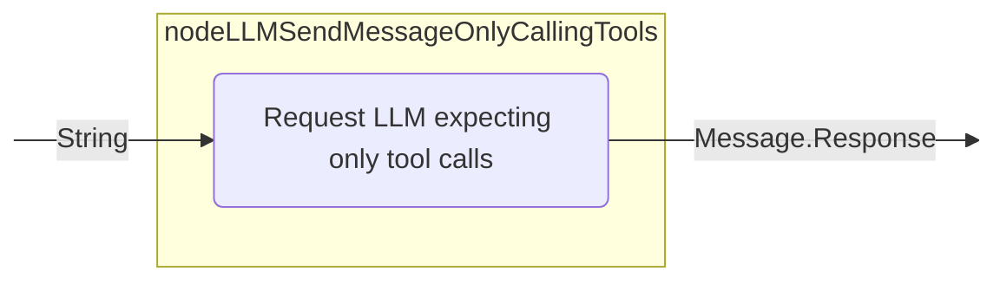

### nodeLLMSendMessageForceOneTool

A node that that appends a user message to the LLM prompt and forces the LLM to use a specific tool. For details, see [API reference](api:agents-core::ai.koog.agents.core.dsl.extension.nodeLLMSendMessageForceOneTool).

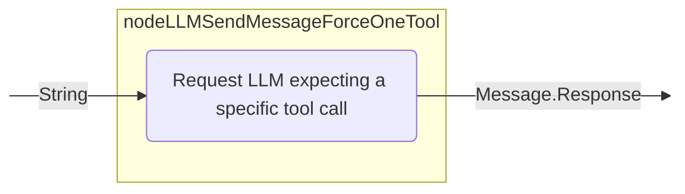

### nodeLLMRequest

A node that appends a user message to the LLM prompt and gets a response with optional tool usage. The node configuration determines whether
tool calls are allowed during the processing of the message. For details, see [API reference](api:agents-core::ai.koog.agents.core.dsl.extension.nodeLLMRequest).

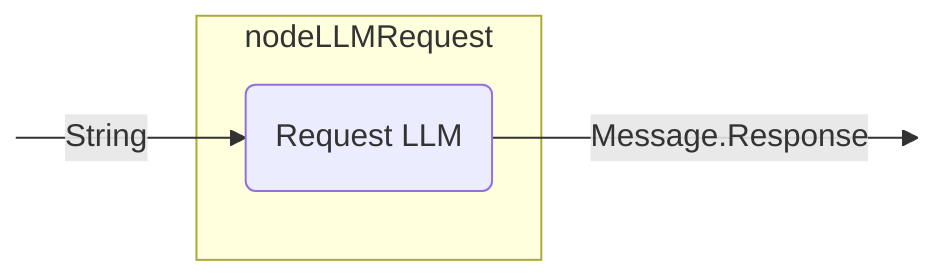

You can use this node for the following purposes:

- Generate LLM response for the current prompt, controlling if the LLM is allowed to generate tool calls.

Here is an example:

<!--- INCLUDE
import ai.koog.agents.core.dsl.builder.forwardTo
import ai.koog.agents.core.dsl.builder.strategy
import ai.koog.agents.core.dsl.extension.nodeLLMRequest
import ai.koog.agents.core.dsl.extension.nodeDoNothing

val strategy = strategy<String, String>("strategy_name") {
    val getUserQuestion by nodeDoNothing<String>()
-->
<!--- SUFFIX
}
-->
```kotlin
val requestLLM by nodeLLMRequest("requestLLM", allowToolCalls = true)
edge(getUserQuestion forwardTo requestLLM)
```
<!--- KNIT example-nodes-and-component-04.kt -->

### nodeLLMRequestStructured

A node that appends a user message to the LLM prompt and requests structured data from the LLM with error correction capabilities. For details, see [API reference](api:agents-core::ai.koog.agents.core.dsl.extension.nodeLLMRequestStructured).

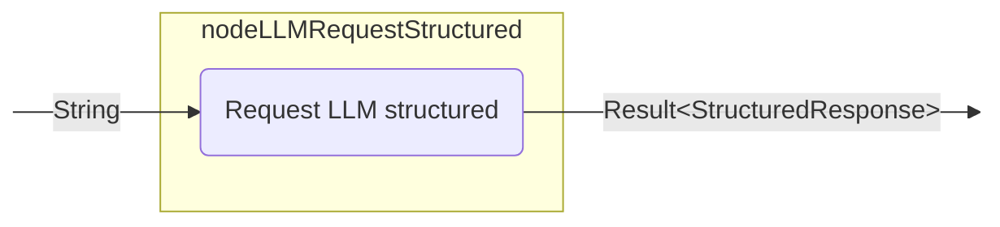

### nodeLLMRequestStreaming

A node that appends a user message to the LLM prompt and streams LLM response with or without stream data transformation. For details, see [API reference](api:agents-core::ai.koog.agents.core.dsl.extension.nodeLLMRequestStreaming).

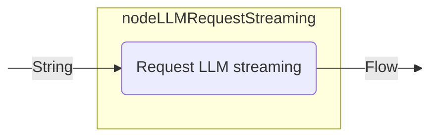

### nodeLLMRequestMultiple

A node that appends a user message to the LLM prompt and gets multiple LLM responses with tool calls enabled. For details, see [API reference](api:agents-core::ai.koog.agents.core.dsl.extension.nodeLLMRequestMultiple).

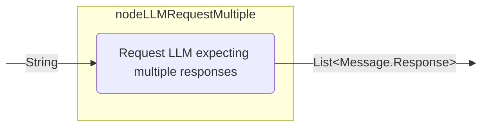

You can use this node for the following purposes:

- Handle complex queries that require multiple tool calls.
- Generate multiple tool calls.
- Implement a workflow that requires multiple parallel actions.

Here is an example:

<!--- INCLUDE
import ai.koog.agents.core.dsl.builder.forwardTo
import ai.koog.agents.core.dsl.builder.strategy
import ai.koog.agents.core.dsl.extension.nodeLLMRequestMultiple
import ai.koog.agents.core.dsl.extension.nodeDoNothing

val strategy = strategy<String, String>("strategy_name") {
    val getComplexUserQuestion by nodeDoNothing<String>()
-->
<!--- SUFFIX
}
-->
```kotlin
val requestLLMMultipleTools by nodeLLMRequestMultiple()
edge(getComplexUserQuestion forwardTo requestLLMMultipleTools)
```
<!--- KNIT example-nodes-and-component-05.kt -->

### nodeLLMCompressHistory

A node that compresses the current LLM prompt (message history) into a summary, replacing messages with a concise summary (TL;DR). For details, see [API reference](api:agents-core::ai.koog.agents.core.dsl.extension.nodeLLMCompressHistory).
This is useful for managing long conversations by compressing the history to reduce token usage.

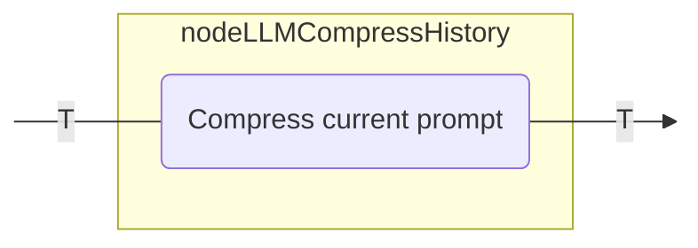

To learn more about history compression, see [History compression](history-compression.md).

You can use this node for the following purposes:

- Manage long conversations to reduce token usage.
- Summarize conversation history to maintain context.
- Implement memory management in long-running agents.

Here is an example:

<!--- INCLUDE
import ai.koog.agents.core.dsl.builder.forwardTo
import ai.koog.agents.core.dsl.builder.strategy
import ai.koog.agents.core.dsl.extension.nodeLLMCompressHistory
import ai.koog.agents.core.dsl.extension.nodeDoNothing
import ai.koog.agents.core.dsl.extension.HistoryCompressionStrategy

val strategy = strategy<String, String>("strategy_name") {
    val generateHugeHistory by nodeDoNothing<String>()
-->
<!--- SUFFIX
}
-->
```kotlin
val compressHistory by nodeLLMCompressHistory<String>(
    "compressHistory",
    strategy = HistoryCompressionStrategy.FromLastNMessages(10),
    preserveMemory = true
)
edge(generateHugeHistory forwardTo compressHistory)
```
<!--- KNIT example-nodes-and-component-06.kt -->

## Tool nodes

### nodeExecuteTool

A node that executes a single tool call and returns its result. This node is used to handle tool calls made by the LLM. For details, see [API reference](api:agents-core::ai.koog.agents.core.dsl.extension.nodeExecuteTool).

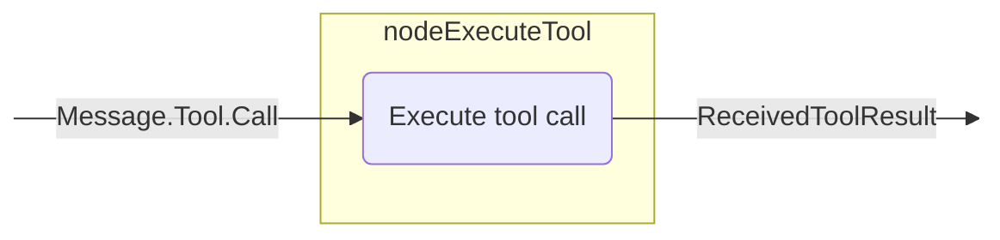

You can use this node for the following purposes:

- Execute tools requested by the LLM.
- Handle specific actions in response to LLM decisions.
- Integrate external functionality into the agent workflow.

Here is an example:

<!--- INCLUDE
import ai.koog.agents.core.dsl.builder.forwardTo
import ai.koog.agents.core.dsl.builder.strategy
import ai.koog.agents.core.dsl.extension.nodeExecuteTool
import ai.koog.agents.core.dsl.extension.nodeLLMRequest
import ai.koog.agents.core.dsl.extension.onToolCall

val strategy = strategy<String, String>("strategy_name") {
-->
<!--- SUFFIX
}
-->
```kotlin
val requestLLM by nodeLLMRequest()
val executeTool by nodeExecuteTool()
edge(requestLLM forwardTo executeTool onToolCall { true })
```
<!--- KNIT example-nodes-and-component-07.kt -->

### nodeLLMSendToolResult

A node that adds a tool result to the prompt and requests an LLM response. For details, see [API reference](api:agents-core::ai.koog.agents.core.dsl.extension.nodeLLMSendToolResult).

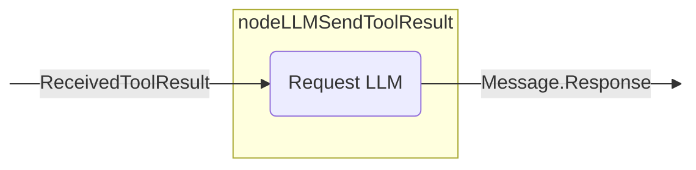

You can use this node for the following purposes:

- Process the results of tool executions.
- Generate responses based on tool outputs.
- Continue a conversation after tool execution.

Here is an example:

<!--- INCLUDE
import ai.koog.agents.core.dsl.builder.forwardTo
import ai.koog.agents.core.dsl.builder.strategy
import ai.koog.agents.core.dsl.extension.nodeExecuteTool
import ai.koog.agents.core.dsl.extension.nodeLLMSendToolResult

val strategy = strategy<String, String>("strategy_name") {
-->
<!--- SUFFIX
}
-->
```kotlin
val executeTool by nodeExecuteTool()
val sendToolResultToLLM by nodeLLMSendToolResult()
edge(executeTool forwardTo sendToolResultToLLM)
```
<!--- KNIT example-nodes-and-component-08.kt -->

### nodeExecuteMultipleTools

A node that executes multiple tool calls. These calls can optionally be executed in parallel. For details, see [API reference](api:agents-core::ai.koog.agents.core.dsl.extension.nodeExecuteMultipleTools).

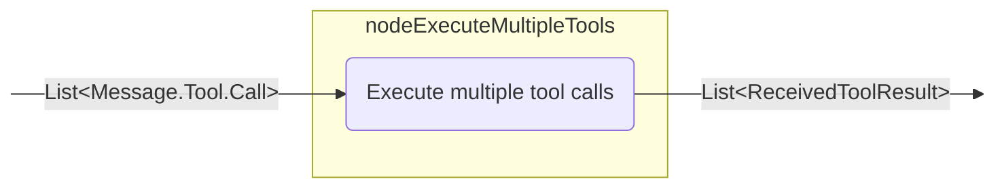

You can use this node for the following purposes:

- Execute multiple tools in parallel.
- Handle complex workflows that require multiple tool executions.
- Optimize performance by batching tool calls.

Here is an example:

<!--- INCLUDE
import ai.koog.agents.core.dsl.builder.forwardTo
import ai.koog.agents.core.dsl.builder.strategy
import ai.koog.agents.core.dsl.extension.nodeLLMRequestMultiple
import ai.koog.agents.core.dsl.extension.nodeExecuteMultipleTools
import ai.koog.agents.core.dsl.extension.onMultipleToolCalls

val strategy = strategy<String, String>("strategy_name") {
-->
<!--- SUFFIX
}
-->
```kotlin
val requestLLMMultipleTools by nodeLLMRequestMultiple()
val executeMultipleTools by nodeExecuteMultipleTools()
edge(requestLLMMultipleTools forwardTo executeMultipleTools onMultipleToolCalls { true })
```
<!--- KNIT example-nodes-and-component-09.kt -->

### nodeLLMSendMultipleToolResults

A node that adds multiple tool results to the prompt and gets multiple LLM responses. For details, see [API reference](api:agents-core::ai.koog.agents.core.dsl.extension.nodeLLMSendMultipleToolResults).

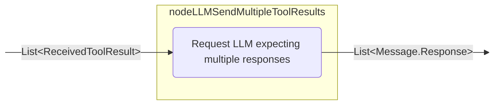

You can use this node for the following purposes:

- Process the results of multiple tool executions.
- Generate multiple tool calls.
- Implement complex workflows with multiple parallel actions.

Here is an example:

<!--- INCLUDE
import ai.koog.agents.core.dsl.builder.forwardTo
import ai.koog.agents.core.dsl.builder.strategy
import ai.koog.agents.core.dsl.extension.nodeLLMSendMultipleToolResults
import ai.koog.agents.core.dsl.extension.nodeExecuteMultipleTools

val strategy = strategy<String, String>("strategy_name") {
-->
<!--- SUFFIX
}
-->
```kotlin
val executeMultipleTools by nodeExecuteMultipleTools()
val sendMultipleToolResultsToLLM by nodeLLMSendMultipleToolResults()
edge(executeMultipleTools forwardTo sendMultipleToolResultsToLLM)
```
<!--- KNIT example-nodes-and-component-10.kt -->

## Node output transformation

The framework provides the `transform` extension function that allows you to create transformed versions of nodes 
that apply transformations to their output. This is useful when you need to convert the output of a node 
to a different type or format while preserving the original node's functionality.

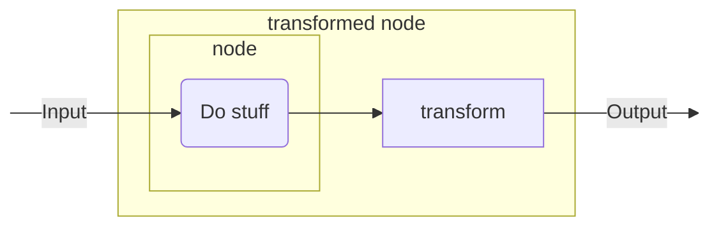

### transform

The [`transform()`](api:agents-core::ai.koog.agents.core.dsl.builder.AIAgentNodeDelegate.transform) function creates a new `AIAgentNodeDelegate` that wraps the original node and applies a transformation function to its output.

<!--- INCLUDE
/**
-->
<!--- SUFFIX
**/
-->
```kotlin
inline fun <reified T> AIAgentNodeDelegate<Input, Output>.transform(
    noinline transformation: suspend (Output) -> T
): AIAgentNodeDelegate<Input, T>
```
<!--- KNIT example-nodes-and-component-11.kt -->

#### Custom node transformation

Transform the output of a custom node to a different data type:

<!--- INCLUDE
import ai.koog.agents.core.dsl.builder.forwardTo
import ai.koog.agents.core.dsl.builder.strategy
import ai.koog.agents.core.dsl.extension.nodeDoNothing

val strategy = strategy<String, Int>("strategy_name") {
-->
<!--- SUFFIX
}
-->
```kotlin
val textNode by nodeDoNothing<String>("textNode").transform<Int> { text ->
    text.split(" ").filter { it.isNotBlank() }.size
}

edge(nodeStart forwardTo textNode)
edge(textNode forwardTo nodeFinish)
```
<!--- KNIT example-nodes-and-component-12.kt -->

#### Built-in node transformation

Transform the output of built-in nodes like `nodeLLMRequest`:

<!--- INCLUDE
import ai.koog.agents.core.dsl.builder.forwardTo
import ai.koog.agents.core.dsl.builder.strategy
import ai.koog.agents.core.dsl.extension.nodeLLMRequest

val strategy = strategy<String, Int>("strategy_name") {
-->
<!--- SUFFIX
}
-->
```kotlin
val lengthNode by nodeLLMRequest("llmRequest").transform<Int> { assistantMessage ->
    assistantMessage.content.length
}

edge(nodeStart forwardTo lengthNode)
edge(lengthNode forwardTo nodeFinish)
```
<!--- KNIT example-nodes-and-component-13.kt -->


## Predefined subgraphs

The framework provides predefined subgraphs that encapsulate commonly used patterns and workflows. These subgraphs simplify the development of complex agent strategies by handling the creation of base nodes and edges automatically.

By using the predefined subgraphs, you can implement various popular pipelines. Here is an example:

1. Prepare the data.
2. Run the task.
3. Validate the task results. If the results are incorrect, return to step 2 with a feedback message to make adjustments.

### subgraphWithTask

A subgraph that performs a specific task using provided tools and returns a structured result. It supports multi-response LLM interactions (the assistant may produce several responses interleaved with tool calls) and lets you control how tool calls are executed. For details, see [API reference](api:agents-ext::ai.koog.agents.ext.agent.subgraphWithTask).

You can use this subgraph for the following purposes:

- Create special components that handle specific tasks within a larger workflow.
- Encapsulate complex logic with clear input and output interfaces.
- Configure task-specific tools, models, and prompts.
- Manage conversation history with automatic compression.
- Develop structured agent workflows and task execution pipelines.
- Generate structured results from LLM task execution, including flows with multiple assistant responses and tool invocations.

The API allows you to fine‑tune execution with optional parameters:

- runMode: controls how tool calls are executed during the task (sequential by default). Use this to switch between different tool execution strategies when supported by the underlying model/executor.
- assistantResponseRepeatMax: limits how many assistant responses are allowed before concluding the task cannot be completed (defaults to a safe internal limit if not provided).

You can provide a task to the subgraph as text, configure the LLM if needed, and provide the necessary tools, and the subgraph will process and solve the task. Here is an example:

<!--- INCLUDE
import ai.koog.agents.core.dsl.builder.strategy
import ai.koog.agents.ext.tool.SayToUser
import ai.koog.prompt.executor.clients.openai.OpenAIModels
import ai.koog.agents.ext.agent.subgraphWithTask
import ai.koog.agents.core.agent.ToolCalls

val searchTool = SayToUser
val calculatorTool = SayToUser
val weatherTool = SayToUser

val strategy = strategy<String, String>("strategy_name") {
-->
<!--- SUFFIX
}
-->
```kotlin
val processQuery by subgraphWithTask<String, String>(
    tools = listOf(searchTool, calculatorTool, weatherTool),
    llmModel = OpenAIModels.Chat.GPT4o,
    runMode = ToolCalls.SEQUENTIAL,
    assistantResponseRepeatMax = 3,
) { userQuery ->
    """
    You are a helpful assistant that can answer questions about various topics.
    Please help with the following query:
    $userQuery
    """
}
```
<!--- KNIT example-nodes-and-component-14.kt -->

### subgraphWithVerification

A special version of `subgraphWithTask` that verifies whether a task was performed correctly and provides details about any issues encountered. This subgraph is useful for workflows that require validation or quality checks. For details, see [API reference](api:agents-ext::ai.koog.agents.ext.agent.subgraphWithVerification).

You can use this subgraph for the following purposes:

- Verify the correctness of task execution.
- Implement quality control processes in your workflows.
- Create self-validating components.
- Generate structured verification results with success/failure status and detailed feedback.

The subgraph ensures that the LLM calls a verification tool at the end of the workflow to check whether the task was successfully completed. It guarantees this verification is performed as the final step and returns a `CriticResult` that indicates whether a task was completed successfully and provides detailed feedback.
Here is an example:

<!--- INCLUDE
import ai.koog.agents.core.dsl.builder.strategy
import ai.koog.agents.ext.tool.SayToUser
import ai.koog.prompt.executor.clients.anthropic.AnthropicModels
import ai.koog.agents.ext.agent.subgraphWithVerification
import ai.koog.agents.core.agent.ToolCalls

val runTestsTool = SayToUser
val analyzeTool = SayToUser
val readFileTool = SayToUser

val strategy = strategy<String, String>("strategy_name") {
-->
<!--- SUFFIX
}
-->
```kotlin
val verifyCode by subgraphWithVerification<String>(
    tools = listOf(runTestsTool, analyzeTool, readFileTool),
    llmModel = AnthropicModels.Sonnet_3_7,
    runMode = ToolCalls.SEQUENTIAL,
    assistantResponseRepeatMax = 3,
) { codeToVerify ->
    """
    You are a code reviewer. Please verify that the following code meets all requirements:
    1. It compiles without errors
    2. All tests pass
    3. It follows the project's coding standards

    Code to verify:
    $codeToVerify
    """
}
```
<!--- KNIT example-nodes-and-component-15.kt -->

## Predefined strategies and common strategy patterns

The framework provides predefined strategies that combine various nodes.
The nodes are connected using edges to define the flow of operations, with conditions that specify when to follow each edge.

You can integrate these strategies into your agent workflows if needed.

### Single run strategy

A single run strategy is designed for non-interactive use cases where the agent processes input once and
returns a result.

You can use this strategy when you need to run straightforward processes that do not require complex logic.

<!--- INCLUDE
import ai.koog.agents.core.agent.entity.AIAgentGraphStrategy
import ai.koog.agents.core.dsl.builder.forwardTo
import ai.koog.agents.core.dsl.builder.strategy
import ai.koog.agents.core.dsl.extension.*

-->
```kotlin

public fun singleRunStrategy(): AIAgentGraphStrategy<String, String> = strategy("single_run") {
    val nodeCallLLM by nodeLLMRequest("sendInput")
    val nodeExecuteTool by nodeExecuteTool("nodeExecuteTool")
    val nodeSendToolResult by nodeLLMSendToolResult("nodeSendToolResult")

    edge(nodeStart forwardTo nodeCallLLM)
    edge(nodeCallLLM forwardTo nodeExecuteTool onToolCall { true })
    edge(nodeCallLLM forwardTo nodeFinish onAssistantMessage { true })
    edge(nodeExecuteTool forwardTo nodeSendToolResult)
    edge(nodeSendToolResult forwardTo nodeFinish onAssistantMessage { true })
    edge(nodeSendToolResult forwardTo nodeExecuteTool onToolCall { true })
}
```
<!--- KNIT example-nodes-and-component-16.kt -->

### Tool-based strategy

A tool-based strategy is designed for workflows that heavily rely on tools to perform specific operations.
It typically executes tools based on the LLM decisions and processes the results.

<!--- INCLUDE
import ai.koog.agents.core.agent.entity.AIAgentGraphStrategy
import ai.koog.agents.core.dsl.builder.forwardTo
import ai.koog.agents.core.dsl.builder.strategy
import ai.koog.agents.core.dsl.extension.*
import ai.koog.agents.core.tools.ToolRegistry

-->
```kotlin
fun toolBasedStrategy(name: String, toolRegistry: ToolRegistry): AIAgentGraphStrategy<String, String> {
    return strategy(name) {
        val nodeSendInput by nodeLLMRequest()
        val nodeExecuteTool by nodeExecuteTool()
        val nodeSendToolResult by nodeLLMSendToolResult()

        // Define the flow of the agent
        edge(nodeStart forwardTo nodeSendInput)

        // If the LLM responds with a message, finish
        edge(
            (nodeSendInput forwardTo nodeFinish)
                    onAssistantMessage { true }
        )

        // If the LLM calls a tool, execute it
        edge(
            (nodeSendInput forwardTo nodeExecuteTool)
                    onToolCall { true }
        )

        // Send the tool result back to the LLM
        edge(nodeExecuteTool forwardTo nodeSendToolResult)

        // If the LLM calls another tool, execute it
        edge(
            (nodeSendToolResult forwardTo nodeExecuteTool)
                    onToolCall { true }
        )

        // If the LLM responds with a message, finish
        edge(
            (nodeSendToolResult forwardTo nodeFinish)
                    onAssistantMessage { true }
        )
    }
}
```
<!--- KNIT example-nodes-and-component-17.kt -->

### Streaming data strategy

A streaming data strategy is designed for processing streaming data from the LLM. It typically requests
streaming data, processes it, and potentially calls tools with the processed data.


<!--- INCLUDE
import ai.koog.agents.core.dsl.builder.forwardTo
import ai.koog.agents.core.dsl.builder.strategy
import ai.koog.agents.example.exampleStreamingApi03.Book
import ai.koog.agents.example.exampleStreamingApi04.markdownBookDefinition
import ai.koog.agents.example.exampleStreamingApi06.parseMarkdownStreamToBooks
-->
```kotlin
val agentStrategy = strategy<String, List<Book>>("library-assistant") {
    // Describe the node containing the output stream parsing
    val getMdOutput by node<String, List<Book>> { booksDescription ->
        val books = mutableListOf<Book>()
        val mdDefinition = markdownBookDefinition()

        llm.writeSession { 
            appendPrompt { user(booksDescription) }
            // Initiate the response stream in the form of the definition `mdDefinition`
            val markdownStream = requestLLMStreaming(mdDefinition)
            // Call the parser with the result of the response stream and perform actions with the result
            parseMarkdownStreamToBooks(markdownStream).collect { book ->
                books.add(book)
                println("Parsed Book: ${book.title} by ${book.author}")
            }
        }

        books
    }
    // Describe the agent's graph making sure the node is accessible
    edge(nodeStart forwardTo getMdOutput)
    edge(getMdOutput forwardTo nodeFinish)
}
```
<!--- KNIT example-nodes-and-component-18.kt -->
